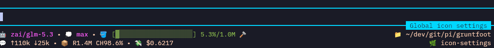

# Gruntfoot

A flexible footer customization extension for [Pi](https://github.com/earendil-works/pi); it includes a full-replacement footer with real-time color and icon customization, themes, and an easy toggle option that persists across sessions.

## Why?

The default Pi footer felt a bit barebones, and depending on the terminal color scheme, the status information felt too "hidden" with muted colors. I wanted something that could be easily customizable, and that allowed me to view the changes from within Pi without having to leave the application, use external editors, etc.

## Toggle

`/gruntfoot` turns the footer on or off. This setting persists across sessions.

When turned off, the default Pi footer is restored.


## Layout



- **Borders**: The separators around the text area do not change color with thinking level anymore, being set to a static color.
- **Chip**: To the bottom right of the text area, a chip area displays the current session name.
- **Status Line**: 
  - **Line 1 (Left)**: Provider/model, thinking level, and context information. Default behavior for provider/model and thinking level is to change color with thinking level, but this can be overridden.
  - **Line 1 (Right)**: Folder path (`pwd`).
  - **Line 2 (Left)**: Input tokens, output tokens, cache stats, and session cost.
  - **Line 2 (Right)**: Git branch, if available.
  - **Line 3**: Other extensions' `setStatus`, joined on one line.

## Colors

> Valid colors are Pi token names, `#RRGGBB` hex, `#RGB` hex, `[0 - 255]` ANSI-256 color codes, or "auto" (default).

`/gruntfoot color` opens a menu where colors can be selected based on role (_e.g._: "Session-name chip", "Usage stats", "Git branch").

Some quirks of color selection:
- "Footer base text" is a special role that sets the default color for unstyled text such as path, branch, and usage stats.
- Context bar allows selections for different colors depending on how full the context is (low, medium, high).
- Backspace resets the color to the default for the role.

This command allows a fluent mode (_e.g._: `/gruntfoot color base muted` sets the "Footer base text" color to `muted`).

`/gruntfoot color-reset` is a shortcut to reset all colors to their defaults.

## Icons

`/gruntfoot icon` opens a new menu where icons can be selected based on role (_e.g._: "Model segment", "Git branch"). Icons are small glyphs added to each footer section to make them more distinctive.

Some quirks of icon selection:
- Icons can be any unicode character (including emoji), but excludes control characters.
- Backspace resets the icon to the default for the role.
- "none" is a special value that removes the icon entirely.

This command allows a fluent mode (_e.g._: `/gruntfoot icon model ⚡❯` sets the "Model segment" icon to `⚡`; `/gruntfoot icon model none` removes the icon from the Model segment.

`/gruntfoot icon-reset` is a shortcut to reset all icons to their defaults.


## Themes

`/gruntfoot theme` opens a menu where the current Gruntfoot look (colors _and_ icons) can be saved to a theme, or loaded from a previously saved theme. Themes are saved in `~/.pi/agent/gruntfoot/themes/` as `{"colors": {…}, "icons": {…}}`. What logically follows is that themes can be shared across machines by copying the `~/.pi/agent/gruntfoot/themes/` directory.

This command allows a fluent mode (_e.g._: `/gruntfoot theme load peachy` loads the "peachy" theme).

> **Breaking change (0.5.0):** theme files now wrap both maps. Flat colors-only theme files from earlier versions are reported as malformed and refused — re-save them (or add the `"icons": {}` wrapper) to convert.


## Install

### npm
```bash
pi install npm:@gsft/gruntfoot
```

### Git

```bash
pi install git:github.com/gruntsoft/gruntfoot
```

## Development

When working in this repo, the package auto-loads via `.pi/settings.json`. Use `/reload` after making changes to pick them up live.

> Any global installation of gruntfoot must be removed first; the package auto-loads via `.pi/settings.json` and a duplicate global install would cause conflicts.


### Dev loop

```bash
npm install
npm run check # tsc --noEmit
npm test # node --test test/ (no terminal or pi instance needed)
```
